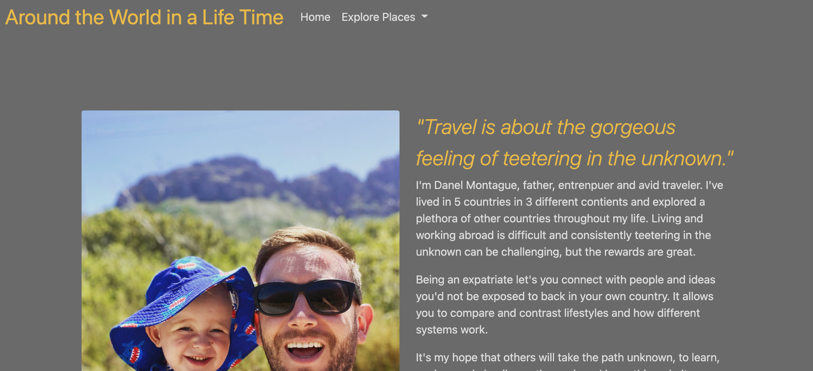

# aroundtheworld

### Table of Content
* Name
* About the Project
* Installation
* How to Use
* Thanks and Credits

## Name
**Around The World in a Lifetime**

## ABOUT
This is a small website dedicated to my lifelong adventure as an expat. Currently it has 3 of the 5 different countries I've lived in, South Africa, Mexico, and China. I give details about the pros and cons of each and a bit of insight about the countries.

## Installation
Regular installation for any website. You can preview by downloading the files. Put the index on VSC and use a live server.

## How to Use
Wait for page to load, watch the animations. You can use the navbar to explore different pages, read articles and take different surveys. Belew is an image of the animation in action

## Shout Outs and Credits
I'd like to thank HyperionDev careers@hyperiondev.com and my mentor Dayle Klinkhame daylek@hyperiondev.com for their guidance on the course and this assignment.
